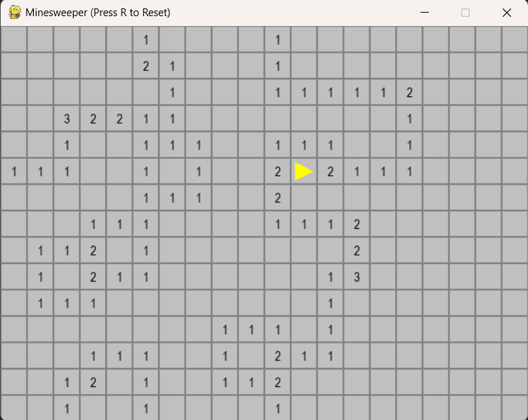

# Classic Minesweeper in Python


## 📌 Overview
This project is an implementation of the classic **Minesweeper** game using Python and the `pygame` library. 

The primary goal of this project was to practice **Object-Oriented Programming (OOP)** principles, implement recursive algorithms, and write maintainable, type-hinted Python code compliant with modern standards.



## 🎮 Game Features
* **Classic Rules:** Reveal cells, flag mines, and clear the board to win.
* **Smart Recursion:** Automatically opens empty areas using the recursive algorithm.
* **Flagging System:** Right-click to flag/unflag potential mines.
* **Win/Loss States:** Detects victory if all safe cells opened or defeat if mine triggered.
* **Instant Restart:** Press `R` to reset the board immediately.

## 🧠 Technical Highlights
This is not just a game clone; it is a demonstration of clean coding practices:

1.  **Object-Oriented Design:**
    * Logic is encapsulated in `GameBoard` and `Cell` classes.
    * State management is separated from the rendering loop.

2.  **Modern Python Features:**
    * **Dataclasses:** Used for the `Cell` class to reduce boilerplate code.
    * **Type Hinting:** Comprehensive type annotations (`List`, `Tuple`, `Generator`) for better code readability and IDE support.
    * **Generators:** Used for efficient neighbor calculation (`yield`).

3.  **Algorithms:**
    * **Recursion:** Implemented to handle the "chain reaction" when opening empty cells.
    * **Neighbor Calculation:** Optimized logic to calculate adjacent mines efficiently using generator expressions.

## 🛠 Installation & Setup

### Prerequisites
* Python 3.8 or higher
* pip (Python package installer)

### Steps
1.  **Clone the repository:**
    ```bash
    git clone https://github.com/vadim1825/Minesweeper.git
    cd Minesweeper-Python
    ```

2.  **Create a virtual environment:**
    ```bash
    python -m venv venv
    # Windows:
    venv\Scripts\activate
    # macOS/Linux:
    source venv/bin/activate
    ```

3.  **Install dependencies:**
    ```bash
    pip install -r requirements.txt
    ```

4.  **Run the game:**
    ```bash
    python minesweeper.py
    ```

## 🕹 Controls

| Key / Mouse | Action |
| :--- | :--- |
| **Left Click** | Reveal a cell |
| **Right Click** | Place / Remove a flag |
| **R** | Restart the game |
| **Close Window** | Quit application |

## 📂 Project Structure

```text
Minesweeper-Python/
│
├── minesweeper.py       # Main source code (Game Logic + Rendering)
├── requirements.txt     # List of dependencies
├── README.md            # Project documentation
└── .gitignore           # Python cache and environment files
